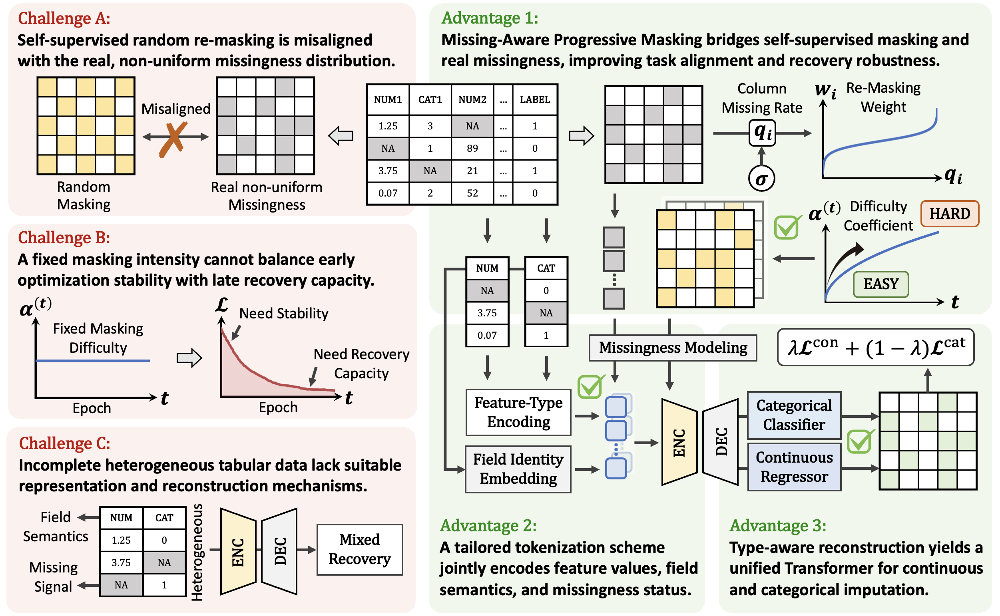
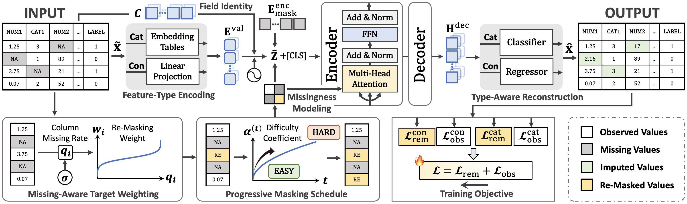

# MAPTab: Missing-Aware Progressive Masking for Self-Supervised Tabular Imputation
Missing values are pervasive in tabular data, compromising data quality and reliability. We present MAPTab, a self-supervised tabular imputation framework that introduces targeted improvements over masked modeling approaches. Specifically, prior methods rely on random masking to construct training objectives, which fails to reflect non-uniform missingness patterns, while a fixed masking intensity cannot jointly provide stable early-stage optimization and strong late-stage recovery. To address these issues, MAPTab introduces a missing-aware progressive masking strategy that performs weighted re-masking based on the empirical missing tendency of each field and gradually increases masking intensity during training, thereby improving task alignment and recovery robustness through an easy-to-hard learning process. Furthermore, to overcome the lack of a unified and effective input representation and reconstruction mechanism for incomplete heterogeneous tables, MAPTab proposes an imputation-oriented tabular tokenization scheme that jointly encodes feature values, field identity, and missingness status, together with a type-aware reconstruction objective that models continuous and categorical variables separately within a unified Transformer framework. Extensive experiments on nine public datasets demonstrate that MAPTab consistently outperforms 15 competitive baselines across three missingness mechanisms and multiple evaluation settings.


## Design Motivation


The left panel summarizes three core challenges in imputation-oriented masked modeling for incomplete tabular data, while the right panel illustrates the three key components of MAPTab: missing-aware progressive masking, imputation-oriented tabular tokenization, and type-aware reconstruction.


## Overall Architecture of MAPTab


Given an incomplete tabular sample, MAPTab first applies missing-aware progressive masking to construct self-supervised reconstruction targets. The partially observed input is then converted into structured tokens that jointly encode feature values, field identity, and missingness status for Transformer-based context modeling. A type-aware decoder finally reconstructs the full field sequence, using separate prediction heads for continuous and categorical variables to impute naturally missing entries.

We implemented this architecture using **PyTorch**.


## Installation

```bash
pip install -r requirements.txt
```

## Training

```bash
python main.py --config src/config/default.yaml
```
